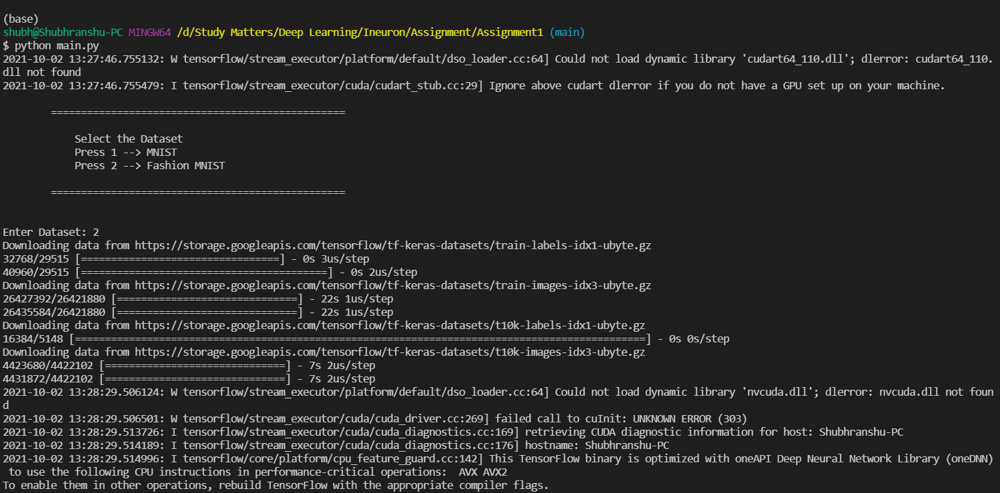
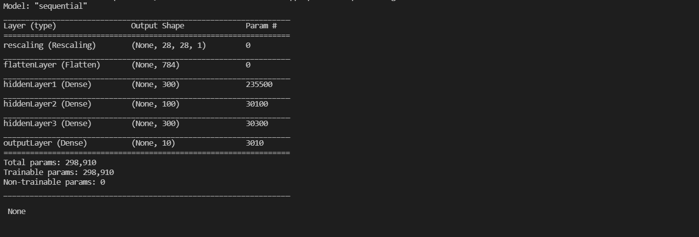
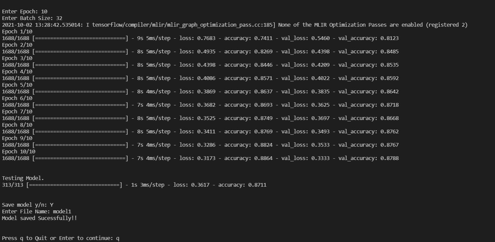
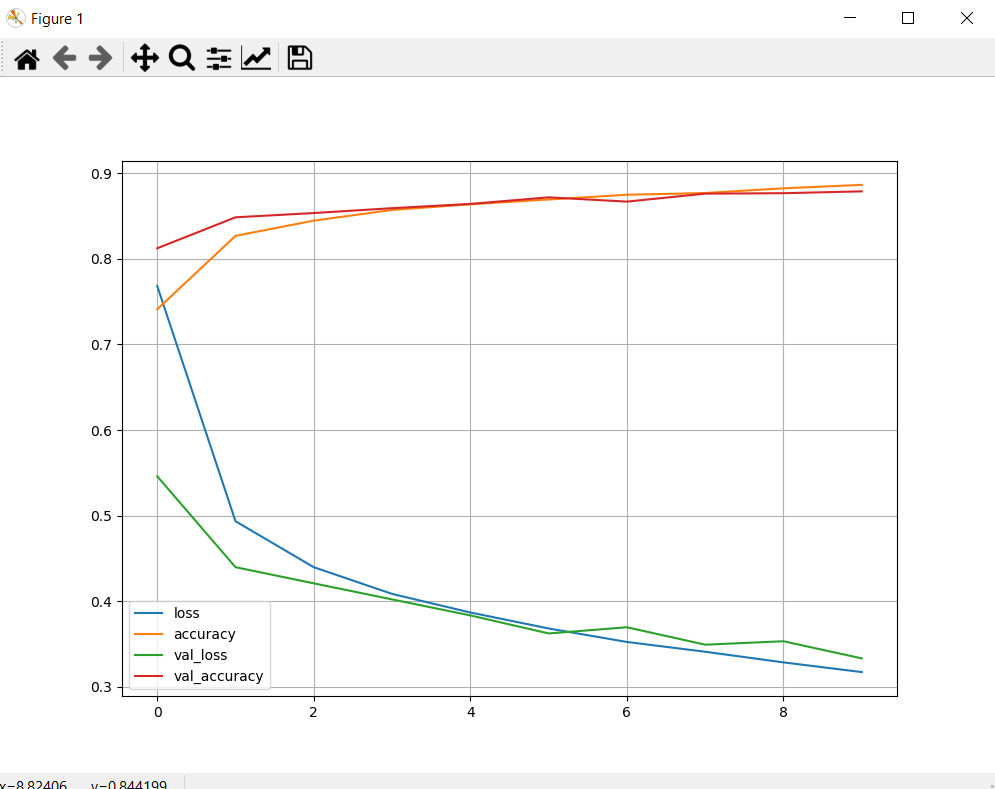

# Ineuron DLCVNLP Assignment 1

## We have to convert the ANN_implementation_demo.ipynb file taken on 26 Sep 2021 into a modular format

1. File1 = Creating model

2. File2 = Getting the dataset

3. Main File = Train on the dataset and save the model

## How to Run it?

```bash

git clone https://github.com/shubranshugupta/ineuron-DLCVNLP-assignments.git

conda activate base

cd Assignment1

pip install -r requirements.txt

python main.py

```








